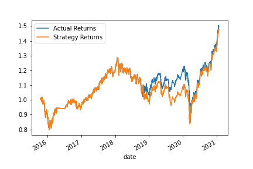

## ML trading bot

ML trading bot (stored as **machine_learning_traing_bot.ipynb**) is a multi-function Jupyter Lab notebook to is a simulation of a trading bot for a stock firm. Improve the existing algorithmic trading systems and maintain the firm’s competitive advantage in the market. Enhance the existing trading signals with machine learning algorithms that can adapt to new data.

**Original Output: (DateOffSet = 3 months, SMA short = 4, long =100)**

**Second Output: (DateOffSet = 6 months, SMA short = 4, long =100)**

When extending the training window we experience a larger difference in results, first in a loss then a positive. Overall the longer training window gave us a much more successful result.

**Third Output: (DateOffSet = 6 months, SMA short = 20, long =150)**

When extending the training window and extending the SMA windows we experience a closer difference in results. However overall we experience more loss by extending the SMA window.

When running the original model using 'SVC'  classifier model we recieved the following results:

When running the alternative model using 'LogisticRegression' classifier model we recieved the following results:

## Technologies

**machine_learning_traing_bot.ipynb** is a Jupyter labnotebook with python abilities. It leverages python 3.7 with the following packages:

* pandas 
* numpy
* hvplot
* matplotlib
* svm (from sklearn)
* DateOffset (from pandas.tseries.offsets)
* StandardScaler (from sklearn.preprocessing)
* classification_report (from sklearn.metrics)

Data in this notebook is pulled from CSV file (emerging_mnarkets_ohlcv.csv) in the Resources folder. It is provided in the repository

## Installation Guide

This file is accessible via Jupyter Lab in your browser. Be sure to Restart Kernel when launching

## Contributors

*Brought to you by Quianna Rolston*
> * [Email @ Quianna](quiannarolston@gmail.com)

> * [LinkedIn](https://www.linkedin.com/in/quianna-rolston/)

---

## License

UC Berkeley - FinTech Bootcamp '22